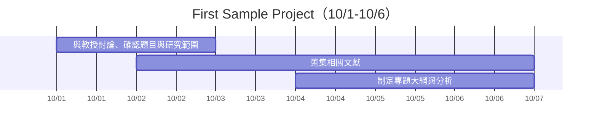
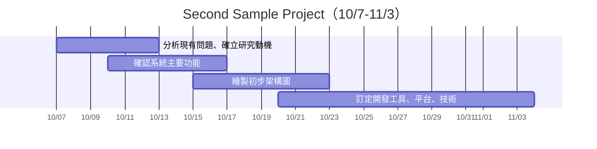
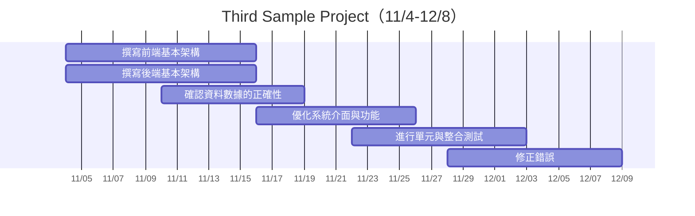
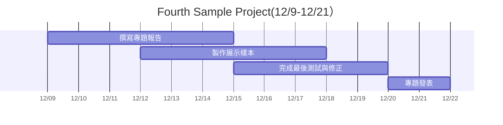

```mermaid
gantt
    title First Sample Project（10/1-10/6）
    dateFormat  YYYY-MM-DD
    axisFormat  %m/%d
    todayMarker off
    與教授討論、確認題目與研究範圍   :a1, 2025-10-01, 2d
    蒐集相關文獻                     :a2, 2025-10-02, 5d
    制定專題大綱與分析               :a3, 2025-10-04, 3d
```

```mermaid
gantt
    title Second Sample Project（10/7-11/3）
    dateFormat  YYYY-MM-DD
    axisFormat  %m/%d
    todayMarker off
    分析現有問題、確立研究動機       :b1, 2025-10-07, 6d
    確認系統主要功能                 :b2, 2025-10-10, 7d
    繪製初步架構圖                   :b3, 2025-10-15, 8d
    訂定開發工具、平台、技術         :b4, 2025-10-20, 15d
```

```mermaid
gantt
    title Third Sample Project（11/4-12/8）
    dateFormat  YYYY-MM-DD
    axisFormat  %m/%d
    todayMarker off
    撰寫前端基本架構                 :c1, 2025-11-04, 12d
    撰寫後端基本架構                 :c2, 2025-11-04, 12d
    確認資料數據的正確性             :c3, 2025-11-10, 9d
    優化系統介面與功能               :c4, 2025-11-16, 10d
    進行單元與整合測試               :c5, 2025-11-22, 11d
    修正錯誤                         :c6, 2025-11-28, 11d
```

```mermaid
gantt
    title Fourth Sample Project(12/9-12/21）
    dateFormat  YYYY-MM-DD
    axisFormat  %m/%d
    todayMarker off
    撰寫專題報告                     :d1, 2025-12-09, 6d
    製作展示樣本                     :d2, 2025-12-12, 6d
    完成最後測試與修正               :d3, 2025-12-15, 5d
    專題發表                         :d4, 2025-12-20, 2d
```

```mermaid
flowchart LR
    A["與教授討論、確認題目與研究範圍<br/>(2025-10-01 - 2025-10-03)"]
    B["蒐集相關文獻<br/>(2025-10-02 - 2025-10-06)"]
    C["制定專題大綱與分析<br/>(2025-10-04 - 2025-10-06)"]
    D["分析現有問題、確立研究動機<br/>(2025-10-07 - 2025-10-12)"]
    E["確認系統主要功能<br/>(2025-10-10 - 2025-10-16)"]
    F["繪製初步架構圖<br/>(2025-10-15 - 2025-10-22)"]
    G["訂定開發工具、平台、技術<br/>(2025-10-20 - 2025-11-03)"]
    H["撰寫前後端基本架構<br/>(2025-11-04 - 2025-11-15)"]
    I["確認資料數據的正確性<br/>(2025-11-10 - 2025-11-18)"]
    J["優化系統介面與功能<br/>(2025-11-16 - 2025-11-25)"]
    K["進行單元與整合測試<br/>(2025-11-22 - 2025-12-02)"]
    L["修正錯誤<br/>(2025-11-28 - 2025-12-08)"]
    M["撰寫專題報告<br/>(2025-12-09 - 2025-12-14)"]
    N["製作展示樣本<br/>(2025-12-12 - 2025-12-17)"]
    O["完成最後測試與修正<br/>(2025-12-15 - 2025-12-19)"]
    P["專題發表<br/>(2025-12-20 - 2025-12-21)"]

    A -->|FS| C
    B -->|SS| C
    C -->|FS| D
    D -->|SS| E
    E -->|SS| F
    F -->|SS| G
    G -->|FS| H
    G -->|FS| I
    H -->|FS| J
    I -->|SS| J
    H -->|FS| K
    I -->|FS| K
    J -->|FS| L
    K -->|SS| L
    L -->|FS| M
    L -->|FS| N
    L -->|FS| O
    M -->|FS| P
    N -->|FS| P
    O -->|FS| P
```
