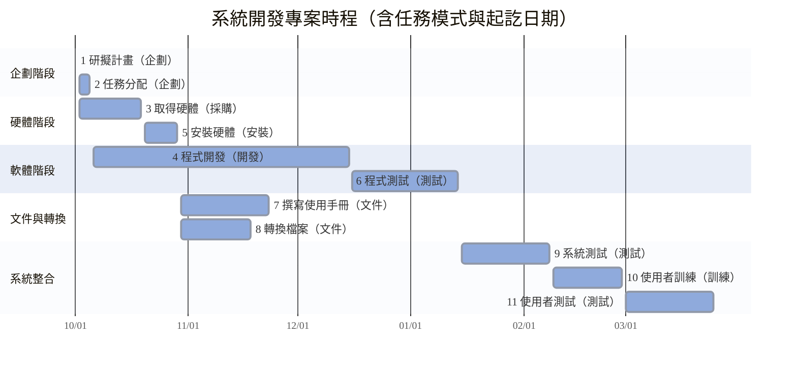
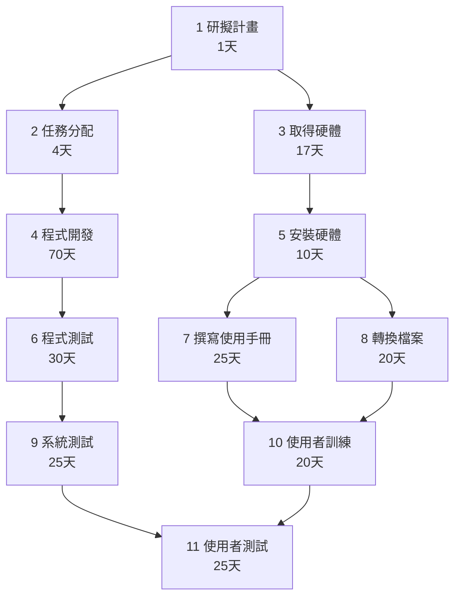

| 任務 | 描述 | 前置 | 工期(天) | 最早開始 | 最早完成 | 最晚開始 | 最晚完成 |
|------|------|------|-----------|-----------|-----------|-----------|-----------|
| 1 | 研擬計畫 | - | 1 | 0 | 1 | 0 | 1 |
| 2 | 任務分配 | 1 | 4 | 1 | 5 | 1 | 5 |
| 4 | 程式開發 | 2 | 70 | 5 | 75 | 5 | 75 |
| 6 | 程式測試 | 4 | 30 | 75 | 105 | 75 | 105 |
| 9 | 系統測試 | 6 | 25 | 105 | 130 | 105 | 130 |
| 11 | 使用者測試 | 9 | 25 | 130 | 155 | 130 | 155 |

**➡ 關鍵路徑：**
> 1 → 2 → 4 → 6 → 9 → 11  

